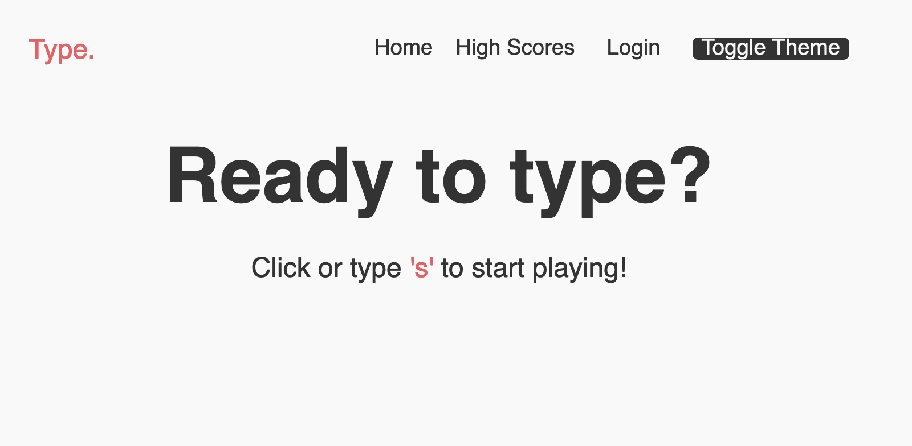
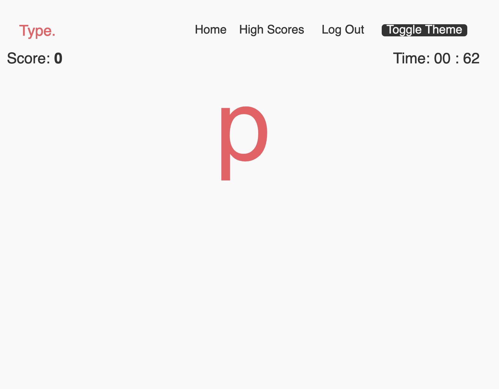
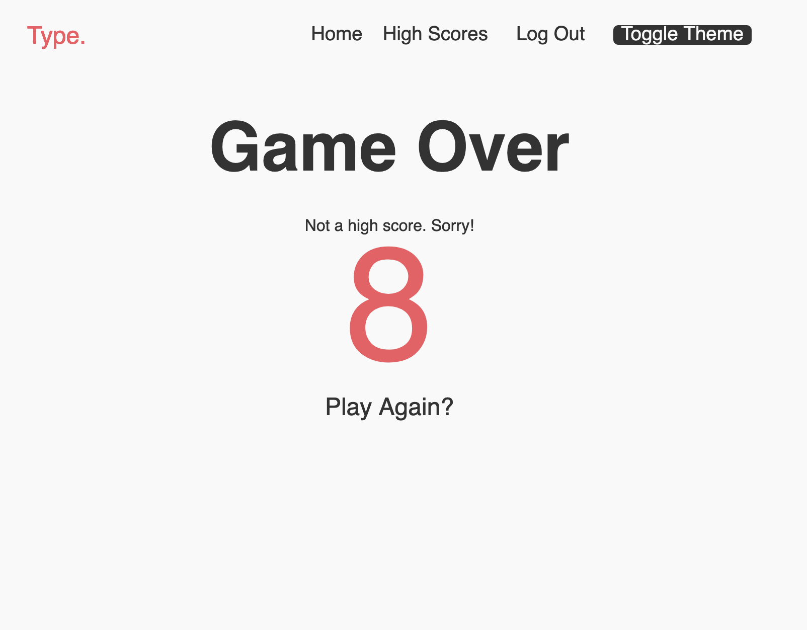
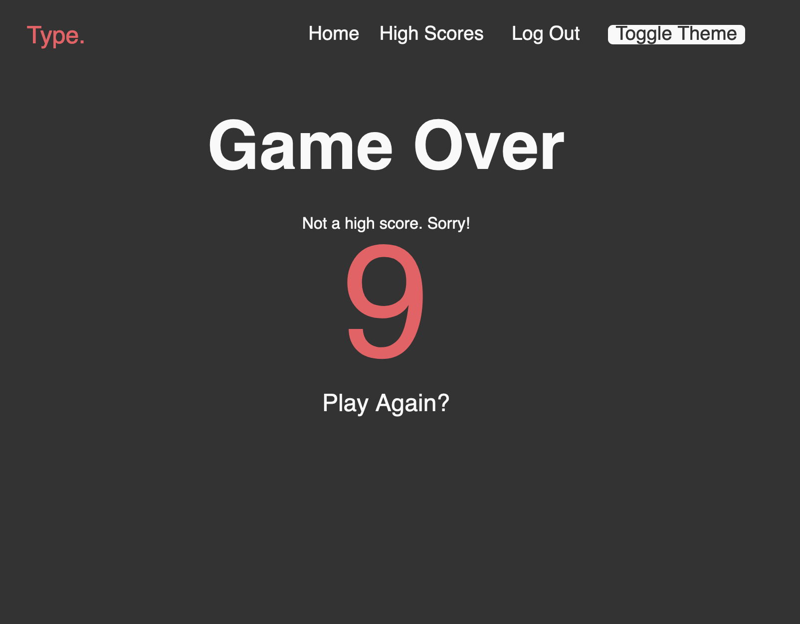

# Type. 

Type. is a reaction-time based typing game where users can score by typing characters as fast as they can in a short time frame.

The frontend uses modern React (Hooks and Context API) and manages global state.

The backend uses serverless functions served on Netlify and uses Airtable as a database.

[Deployed site](https://determined-curran-d92e8e.netlify.app)

## Packages used
0. dotenv (for storing private credentials)
1. React Router (for routing)
2. Styled Components (for styling)
3. Auth0 (for authorization)
4. JSON Web Tokens (for authentication)
5. Airtable (for database)
6. Netlify (for continuous integration of funnctions and application)

## Running Locally

At the root of the project, you should have a .env.sample to show the structure of the .env file

```js
AIRTABLE_API_KEY=
AIRTABLE_BASE=
AIRTABLE_TABLE=

AUTH0_KEY_ID=
AUTH0_DOMAIN=
```

Create and fill the .env file in with the appropriate data and run using ```netlify dev```

## Screenshots

### Home 


### Login/Sign Up


### Game


### Game Over


### High Scores


### Dark Mode

